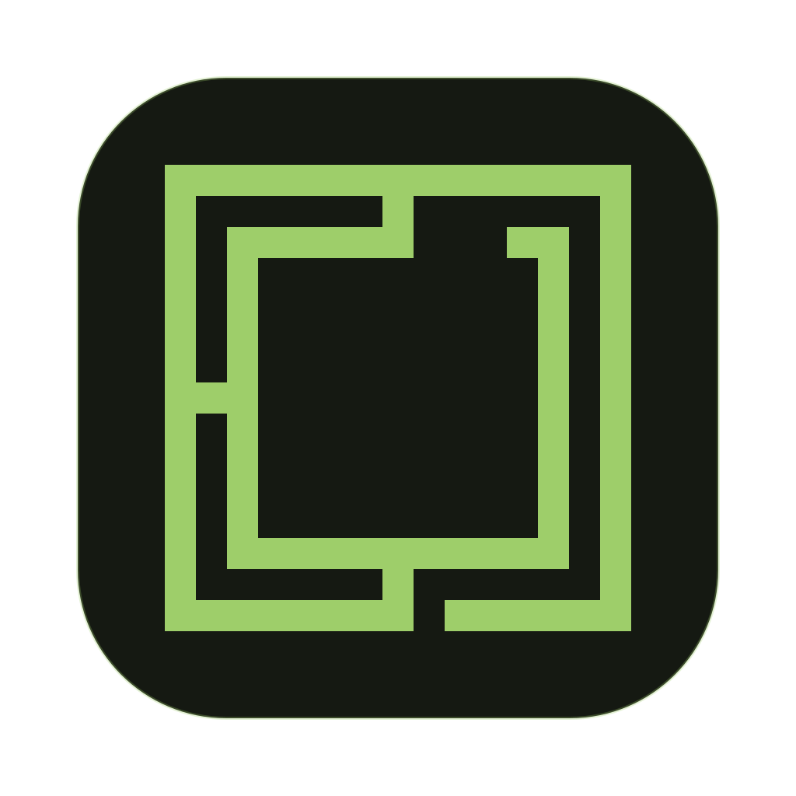

<p align="center">
  
</p>

<h1 align="center">Omarchy for Windows</h1>

Run [Omarchy](https://omarchy.org) on Windows 10 or 11 with QEMU and Windows Hypervisor Platform (WHPX). Windows stays installed, and the Linux disk lives in a folder you choose. The visible Windows app, Start entry, Desktop shortcut, and tray are named **Omarchy**. Settings are inside the app's tray and settings dialog. The launcher filename `TryOmarchy.exe` and existing data-folder names remain for upgrade compatibility.

Download, boot, Hyprland.


**Status of this fork: development preview.** On a Windows 11 Pro host with an RTX 5080, the installed launcher booted the existing guest in Immersive mode and Hyprland reported 2560×1440 at 360 Hz, matching the primary Windows monitor. Notepad, File Explorer, an idle League client, and Character Map each appeared as separate tiled Omarchy windows in preview tests. Character Map's visible in-Omarchy character-grid click selected the wrong character on Windows, and modern Notepad ignored posted text. A later isolated guest-to-host bridge test with revised frame alignment correctly selected B in Character Map, but did not repeat the GTK presenter click. A controlled classic Win32 Edit accepted text. An opt-in Windows Graphics Capture prototype delivered Character Map frames through the guest bridge after a bounded startup fallback, but gameplay, fullscreen match capture, controls, and latency remain unverified. **This bridge does not yet work reliably with every Windows app.** See [the host test notes](docs/evidence/WINDOWS-HOST-INTEGRATION-2026-09-26.md), [display matching](docs/DISPLAY-MATCHING.md), [Windows app details](docs/WINDOWS-APPS.md), and [the compatibility architecture](docs/SEAMLESS-WINDOWS-ARCHITECTURE.md).

**The requested complete product is blocked by its universal Windows-surface requirement.** The requirement includes capture-excluded windows, protected content, UAC, and sign-in inside Omarchy, with no Windows-side exceptions. This per-window bridge cannot provide that guarantee. Supported capture APIs can exclude content, and the ordinary desktop bridge cannot access the secure desktop. Privileged remote-desktop software can handle some secure-desktop transitions, but that does not establish universal, independent Hyprland windows. The preview is not an accepted substitute for this requirement; see [the full requested scope and status](docs/FORK-GOAL-STATUS.md).

This fork builds on [Try Omarchy for Windows](https://github.com/omacom/try-omarchy-windows) by [Omacom](https://github.com/omacom).
The Omarchy mark in the app icon is sourced from the
[official Omarchy brand kit](https://omarchy.org/brand/) and remains subject to
Omarchy's trademark rights.

The [upstream v0.0.20 preview](https://github.com/omacom/try-omarchy-windows/releases/tag/v0.0.20-preview) does **not** contain this fork's Windows window preview or resource-profile changes. This fork does not yet publish a complete one-click installer. Its [candidate guest image was built and booted in CI](https://github.com/z4mbo/Omarchy-Windows/actions/runs/36253111377), with the Windows-app menu and per-boot bridge token present. The complete image also [booted headlessly on a physical Windows WHPX host](docs/evidence/FRESH-GUEST-CANDIDATE-2026-09-26.md), where isolated portable and standard first-install setup tests passed. A physical one-click installer and graphical fresh-guest test remain open. Public release also needs an independent update-signing key and Azure Artifact Signing configured for this repository. The existing-guest setup below works for development and testing.

## Current capabilities and limits

- **Omarchy desktop**: Hyprland, themes, tray, clipboard, audio, shared folders, file drops, and guest lifecycle are available through one Windows launcher. New or reset guests use the image version bundled with the selected release.
- **GPU translation**: Hyprland and tested OpenGL programs use the Windows GPU through VirGL. On the RTX 5080 host, Blender 5.2.2 viewport, Workbench and conservative Eevee scenes, Godot Compatibility mode, and SuperTuxKart ran. Blender Cycles used CPU. Native NVIDIA CUDA/OptiX, PCI GPU passthrough, and reliable Vulkan gaming are not available in this VM configuration; see [compatibility](docs/COMPATIBILITY.md).
- **Display matching**: a new settings file defaults to Immersive fullscreen. The launcher reads Windows monitor modes at launch; the installed bundled runtime advertised 2560×1440 at 360 Hz to Hyprland on the tested primary monitor. Existing windowed choices remain saved. Windowed mode follows the window's client size, and mixed-refresh displays and live monitor changes have [limits](docs/DISPLAY-MATCHING.md).
- **Host-aware resources**: Balanced and Maximum Performance profiles size vCPUs and RAM from Windows' current load. Maximum Performance keeps at least one third of total RAM available for later Windows activity. Automatic profiles also lower QEMU's CPU scheduling priority while another Windows app is active and the CPU stays busy, then restore it when Omarchy is active or load drops. [Native scheduling tests passed](docs/evidence/ADAPTIVE-CPU-2026-09-26.md); simultaneous game performance remains unmeasured. Guest vCPU count and RAM do not resize while running with the installed runtime. A [separate experimental RAM-return runtime](docs/evidence/BALLOON-EXPERIMENT-2026-09-26.md) returned resident memory to Windows through two physical 4→2→4 GiB cycles with 120 guest integrity checks. It remains opt-in and disconnected from normal launches pending longer gaming and graphics stability checks.
- **Separate Windows app windows in Omarchy**: the opt-in preview mirrors host-granted top-level Windows windows into individual GTK4/Hyprland surfaces. Notepad and File Explorer tiled side by side in a physical test; Character Map did too after the grant gate was installed. Existing Windows windows require selection from the Omarchy tray on Windows. The host still runs the app, so it keeps its Windows files and drivers. Default capture uses `PrintWindow` and PNG; an opt-in Windows Graphics Capture prototype delivered Character Map frames through the guest bridge. A later isolated guest-to-host B-click test passed after frame alignment, but the earlier visible GTK presenter click failed and has not been retested successfully. The transport is not yet suitable for gameplay.
- **Fullscreen preview**: a synthetic borderless Windows test window was detected as fullscreen and filled the Omarchy output. The League client-to-match transition, actual match frames, controls, and same-workspace behavior remain unverified.
- **Single visible Windows app**: installed shortcuts and Apps registration say Omarchy; Settings lives in its tray. The launcher keeps the existing `TryOmarchy.exe` filename so current installations update without deleting their Linux disk.
- **Two-way text and image clipboard sharing** between Windows and Omarchy (own compositor-native bridge over wl-clipboard, no SPICE) and **folder sharing** over virtio-9p: standard installs offer to create `Omarchy Shared` in your Windows home, then pin it in Omarchy's Files sidebar and link it into the Linux home. The tray can open the Windows folder at any time. File and folder clipboard transfers stream in the background. Drop Windows files into the Omarchy window to copy them into the supported folder under the pointer, or Downloads when that folder cannot accept the drop. Larger copies show small, nonblocking progress with cancellation. Dropping directly into arbitrary guest applications remains unfinished.
- First boot offers an instant trial account or Omarchy's normal personalized account setup, with SDDM autologin after either path. Instant mode keeps `omarchy` as both the local username and lock-screen password, shows that on the setup splash, and repeats it once on the first desktop. Sudo remains passwordless in this disposable local trial.
- Reproducible x86_64 guest image build (containerized, package-locked, pinned Omarchy revision) and a headless QMP control plane for automated testing.

See [app compatibility](docs/COMPATIBILITY.md), [Windows app integration](docs/WINDOWS-APPS.md), and the [v1 checklist](docs/V1-READINESS.md) for details.

Latest isolated research: [WSL Blender window forwarding and a separate CUDA render](docs/evidence/WSL-WAYPIPE-COMPANION-2026-09-26.md), and [the Windows RAM controller with independent VM control connections](docs/evidence/BALLOON-ADAPTER-2026-09-26.md). Neither experiment is enabled by normal launches or establishes universal Windows-app support.

| First run | Screensaver |
|---|---|
|  |  |

## Essential keys

- **Windows key** acts as Super, but only while the Omarchy window is focused. Everywhere else it stays your normal Windows key, so the Start menu and Win+Shift+S keep working.
- **Ctrl+Alt+F** fullscreens the VM window itself on your Windows desktop (SUPER+F, below, is the in-Omarchy one).
- **Ctrl+Alt+G** grabs or releases raw keyboard input. If the host steals a shortcut you meant for Omarchy, grab first. Same trick if you're driving the VM over VNC or RDP and focus gets weird.
- Hyprland is keyboard-first by design and the first hour is the adjustment period. Learn two keys and the rest follows: **SUPER+SPACE** opens the Omarchy menu, **SUPER+K** opens the keybinding viewer with every binding and its description. The everyday starters: SUPER+RETURN opens a terminal, SUPER+W closes the focused window, SUPER+F fullscreens it.

## Architecture

Same recipe as the excellent macOS [try-omarchy](https://github.com/themartiano/try-omarchy) (QEMU + Apple Hypervisor Framework + VirGL), translated to Windows:

| Piece | macOS (try-omarchy) | This project |
|---|---|---|
| Hypervisor | Hypervisor.framework | Windows Hypervisor Platform (WHPX) |
| Guest image | ARM64 Arch + Omarchy | x86_64 Arch + Omarchy |
| Graphics | VirGL | virtio-gpu VirGL OpenGL; Venus is present but not a reliable tested game path; llvmpipe fallback |
| App shell | Swift/AppKit | Go: one console-less `TryOmarchy.exe` (PowerShell scripts remain as a fallback path) |

WHPX works on Windows Home and Pro (it's the same platform WSL2 rides on), so no Hyper-V role is required. If WSL2 runs on your machine, you're set.

Proven boot recipe: `-accel whpx -machine q35 -cpu qemu64`, direct kernel boot (vmlinuz + initramfs + raw ext4 rootfs on virtio-blk), all-virtio devices, SDL audio with recording support. See [docs/FINDINGS.md](docs/FINDINGS.md) for the details and the traps.

## Try it

There is no packaged release of this fork yet. To test the current launcher on an **existing** Omarchy installation, build it on Windows with Go:

```powershell
git clone https://github.com/z4mbo/Omarchy-Windows.git
cd Omarchy-Windows\app
go build -trimpath -ldflags '-H windowsgui -s -w' -o Omarchy.exe .
.\Omarchy.exe -dir 'C:\Omarchy\TryOmarchy' -no-update
```

Replace the `-dir` path with your existing data folder. The app keeps `vm\disk.raw` and upgrades the stable launcher copy after a healthy boot. **Do not use `-uninstall` for an upgrade**: that removes the guest disk. The `-no-update` flag keeps an older published upstream release from replacing this development build while testing.

For the Windows app preview on an existing guest, follow [the guest integration steps](docs/WINDOWS-APPS.md#getting-the-guest-menu). A normal fresh install still downloads the published image, which predates this fork's per-window menu. The fork's new image passed a CI graphical boot and a physical Windows headless boot with the menu installed; it has not passed a one-click launcher install or been published as a signed release.

After successful setup, the app offers one **Omarchy** Start shortcut and an optional Desktop shortcut. Settings opens from the Omarchy tray. The shortcuts point to a stable launcher in the data folder; opening a newer launcher refreshes that copy after a healthy boot.

While Omarchy is running, its tray icon can reopen the window, open the active shared folder, open Settings, create a diagnostics bundle, or request a clean shutdown.

Published upstream releases use signed update metadata. New files are downloaded and verified before replacing the previous launcher, runtime, or factory image; `vm\disk.raw` is left untouched. This fork's development changes are not in that upstream update channel. Use `-no-update` when testing a source build.

For the full guest OS update, open **Update > Omarchy** inside the guest after updating the launcher. Existing files and the writable guest disk are preserved; launcher rollback does not roll back guest package transactions. See [updating an existing guest](docs/GUEST-UPGRADES.md).

Already have WINQ-EMU at `C:\WINQ-EMU`, or stock QEMU from the old bootstrap? The app prefers what's installed and downloads nothing extra.

The launcher embeds and pins the SHA256 digest of the default release's
`SHA256SUMS` file. It verifies an existing cache before trusting it, records a
manifest-bound install receipt for fast offline launches, and only promotes
fully written rootfs and writable-disk staging files into place. When publishing
a new image release, update `defaultReleaseURL`, `defaultSumsSHA256`, and the
matching fixture in `app/testdata`, plus `currentVersion` in `app/update.go`.
Interrupted payload transfers resume from their `.part` files when the server
supports byte ranges, then the complete file is SHA256-verified before use.
Custom release URLs must be paired with the
trusted manifest digest via `-sums-sha256`.

### Reporting a problem

Run `TryOmarchy.exe -diagnostics`. It writes one zip under the chosen data
folder's `diagnostics` directory with the launcher and QEMU logs, the
guest's console output, redacted settings, install and update state, the guest
manifest, and machine facts (Windows build, CPU, memory). It includes no disk
images or home-folder files and redacts known account paths and SSH key data.
Logs can still contain local details, so review the zip before attaching it.

### Install location

New standard installs ask for a data location before downloading anything. The
default is `%LOCALAPPDATA%\TryOmarchy`. Choosing another local drive or folder
creates a `TryOmarchy` folder there and keeps a small
`%LOCALAPPDATA%\TryOmarchy\data-location.json` pointer so direct launches can
find it. Standard installs require an NTFS or ReFS local drive because the
virtual disk uses sparse files. Network locations are not supported. Existing
installs stay where they are, and an explicit `-dir PATH` still wins for that
launch. Portable mode continues to support exFAT through the `data` and
`payload` folders beside the executable.

### Settings

[Moving an existing installation](docs/MOVING.md) is available from Settings.

The app includes General, Devices, Advanced and Recovery pages, camera
selection and camera/microphone switches, and About and updates. These controls
are in this source branch and are not all part of the published upstream v20 download.
See [desktop controls](docs/DESKTOP-CONTROLS.md) for behavior and validation.

`settings.json` in the chosen data folder keeps the choices that survive a
relaunch. Every row has a matching flag, and a flag given on the command line
wins for that launch:

```json
{
  "schemaVersion": 1,
  "fullscreen": false,
  "memoryMiB": 0,
  "cpus": 0,
  "share": "",
  "shareDisabled": false,
  "sharedFolderPrompted": true,
  "forwards": ["tcp:2222:22"],
  "sshKey": "",
  "render": "auto"
}
```

`fullscreen` is the Immersive mode (`-fullscreen`), `memoryMiB` overrides the
automatic guest RAM sizing (`-memory`, 0 keeps it automatic), `cpus` overrides
the automatic vCPU count (`-cpus`, 0 keeps it automatic), `share` remembers
the Windows folder shared into Omarchy (`-share`), `shareDisabled` turns that
folder off without forgetting it, and `forwards` are loopback port
forwards (`-forward`), and `sshKey` is the public key file to authorize when a
forward targets sshd (`-ssh-key`), and `render` picks the rendering path
(`-render`). Open Settings from the tray or
`TryOmarchy.exe -settings`. Changes apply on the next launch.

`render` is `auto` by default: the launcher tries GPU rendering and, when this
PC cannot run it, remembers that in `render-probe.json` so later launches go
straight to CPU rendering instead of repeating the failed attempts. It retries
the GPU path when the runtime or the display drivers change, and once a day.
`gpu` retries every launch; `cpu` never tries it (`-nogpu` means the same).

Automatic sizing gives the guest all logical processors but two, between two
and eight, and a third of the machine's RAM between 4 and 8 GiB (6 GiB with GPU
rendering, the same as before), reduced to what Windows can spare at launch.

#### CPU and RAM profiles

Open **Settings > General > Resource profile** before starting Omarchy:

- **Balanced** keeps the automatic sizing above.
- **Maximum performance** samples Windows CPU activity for 750 ms and reads
  available physical RAM immediately before starting the VM. It gives Omarchy
  the unused capacity after leaving additional Windows headroom: at least two
  logical processors (one eighth of the host on larger machines), and at least
  4 GiB RAM (one third of physical RAM on larger machines). RAM is rounded down
  to 256 MiB steps. The supported limits remain 64 vCPUs and 64 GiB RAM.
- **Manual** enables the CPU count and RAM fields together. RAM is entered in
  GiB; either field can be 0 to use Balanced sizing for that resource. Requests
  exceeding the host CPU count or leaving less than 2 GiB physical RAM for
  Windows are rejected with an explanation.

Settings shows an estimate using the host state when the window opens. Maximum
performance measures again on launch. The CPU count and maximum guest RAM are
set at boot; Windows and Omarchy share processor scheduling. The launcher does
not pin cores or guarantee an FPS increase. Save, shut down, and relaunch to
apply a profile change. Windows must retain headroom for new applications,
QEMU, and graphics resources.

Balanced and Maximum performance also adjust QEMU's CPU scheduling priority
while the VM runs. If another Windows app is active and overall CPU use stays
at or above 70% for six seconds, the launcher switches QEMU from Normal to Below
Normal priority. Returning to Omarchy restores Normal at the next two-second
sample; CPU use at or below 50% for ten seconds also restores it. This gives active
Windows apps scheduling preference while the guest can still use spare CPU
time. It does not cap CPU usage or promise a game FPS improvement. Manual mode,
hosts with more than 64 logical processors, and a detected manual process
priority change leave scheduling to Windows. Unknown samples restore Normal.
The native Windows test verifies priority changes and manual-override handling
on a disposable process; a simultaneous Windows-game/guest workload remains
an acceptance check.

The current bundled Windows QEMU runtime does not return ballooned
guest pages to Windows physical memory, so guest RAM cannot safely resize live.
Resource profiles measure Windows load at launch and choose the VM's boot-time
capacity. The VM must restart to change guest RAM or vCPU count.

An isolated automatic RAM-controller test also completed a 4→3.5→4 GiB
cycle with 120 successful guest integrity checks and a clean shutdown. It used
real Windows memory readings and 768 MiB of temporary host pressure, with
test-only reserve thresholds to avoid exhausting host RAM. This verifies the
controller's decisions in that setup, not production gaming performance or
equivalent physical RAM return. See the [experiment record](docs/evidence/BALLOON-EXPERIMENT-2026-09-26.md).

If CPU measurement fails, or the PC has more than 64 logical processors,
Maximum performance uses the Balanced CPU count. An unavailable memory query
uses Balanced RAM sizing. A successful query showing insufficient free RAM
stops Maximum performance with an explanation instead of allocating that RAM.
The existing QEMU low-memory retry can still reduce an allocation if conditions
change after measurement; the effective allocation is recorded in `vm/shell.log`.

The profile is saved separately in `resources.json` so older launchers can
still read `settings.json` after rollback. Old CPU/RAM choices are preserved
and select Manual until a profile is chosen. Presets retain those manual values
for later use. Backups and snapshots include the profile.

For one launch, use `-resource-profile maximum-performance`, `balanced`, or
`manual`. Explicit `-cpus` and `-memory` flags override their individual
resources within any profile; `-memory` still takes **MiB**. For example:

```powershell
TryOmarchy.exe -resource-profile maximum-performance
TryOmarchy.exe -resource-profile manual -cpus 16 -memory 24576
```

**Graphics:** Settings > Advanced reports the last successful boot's rendering
path. GPU mode shares Windows' GPU through VirGL OpenGL; Venus Vulkan is present
but has not been reliable on the tested RTX 5080 guest. It
does not assign the physical GPU to Linux. NVIDIA CUDA/OptiX and native PCI GPU
passthrough are not provided by this runtime. See [application and graphics
limits](docs/COMPATIBILITY.md) before relying on a particular game or renderer.

Optional [Blender, Godot and SuperTuxKart launch profiles](docs/GPU-APPLICATIONS.md)
document tested OpenGL paths, a separately built Blender compatibility patch,
installation and rollback. These are experimental application profiles, not a
change to the bundled graphics runtime or a claim of universal GPU support.

The guest follows the Windows time zone, default keyboard layout, and display
language. Each is applied inside Omarchy when it changes on the Windows side,
so a layout, zone, or language chosen inside the guest stays until Windows
changes. `-timezone`, `-keyboard`, and `-locale` override this for a launch:
`keep` leaves the guest alone, or give an IANA zone such as `Europe/Berlin`,
an XKB layout such as `de` or `us:intl`, or a locale such as `de_DE`. The
language takes effect at the next login inside Omarchy.

### Disk capacity

Open Settings and set **Disk capacity (GiB)**, or launch with `-disk-size 64`.
Standard installs accept 24 to 1024 GiB; 0 keeps the release default. The next
launch grows an existing disk in place and preserves its files. Lowering the
setting never shrinks the disk. A fresh guest uses at least the factory image's
required capacity.

Capacity is a limit, not space reserved on Windows. The sparse disk uses host
storage as you add files. Settings shows the current capacity and free space on
the Windows drive. Keep important files backed up outside the guest.

Deleting files inside Omarchy does not shrink the disk file by itself. While
Omarchy is running, `TryOmarchy.exe -reclaim` asks it to write zeros over its
free space, up to what the Windows drive can spare beyond a 4 GiB reserve and
at most 8 GiB per pass, and the disk file shrinks the next time Omarchy shuts
down. Run it again for another pass if a lot was deleted. The tray includes Reclaim disk space and Reclaim status.

This preference is saved separately in `storage.json` so older launchers can
still read their settings after rollback. An explicit `-disk-size` applies only
to that launch. Portable QCOW2 disks keep their existing capacity.

### SSH and port forwarding

Nothing listens by default. To reach Omarchy from Windows tools, forward a
loopback port:

```
TryOmarchy.exe -ssh 2222
```

That forwards `127.0.0.1:2222` to Omarchy's sshd for this session only and
asks the guest to start sshd for that boot. Nothing on your network can reach
it. Your `~/.ssh/id_ed25519.pub` (or `id_ecdsa.pub`, `id_rsa.pub`) is authorized
for the Omarchy account automatically; pass `-ssh-key PATH` to pick another
public key, or use none and log in with the password you chose in Omarchy.
Then:

```
ssh -p 2222 <omarchy-user>@127.0.0.1
```

The same alias works for `scp`, Git, and VS Code Remote SSH. Other services
use `-forward tcp:8080:80` or `-forward udp:5000:5000` (repeatable); the guest
service must listen on its network interface, not only on its own localhost.
From Omarchy, `windows.host:<port>` (10.0.2.2) reaches a service on Windows without any
mapping. Key-only or permanent SSH is Omarchy's own choice: run
`omarchy-setup-security-sshd` inside the guest. A fresh disk (`-fresh`) gets a
new host key, so remove the old `[127.0.0.1]:2222` entry from `known_hosts`
if ssh complains.

### Taking your setup to a real Omarchy install

Inside Omarchy, run `try-omarchy-export`. It writes one archive with your
desktop configuration, theme, and the packages you added, to the shared Windows folder
when one is mounted (`-share`) or to your home folder otherwise. On the real
install, extract it and run the `restore.sh` inside. Keys, password stores,
browser profiles, and unlisted application configs are deliberately left out.
Review the archive before sharing it with anyone. See
[`docs/MIGRATION.md`](docs/MIGRATION.md).

### Offline portable mode

The launcher also accepts `-portable` for an experimental, persistent USB
layout. In this mode it reads an authenticated release payload beside the
executable, makes no setup-time network requests, stores all guest state on the
removable drive, and uses a compact QCOW2 overlay that survives Windows drive
letter changes and works on exFAT. The independently pinned `SHA256SUMS` digest,
install receipts, cancellation handling, and atomic file publication apply to
the portable path too.

See [`docs/PORTABLE_USB.md`](docs/PORTABLE_USB.md) for the expected layout and
host requirements. Bundle preparation and additional host launchers are kept
out of this core Windows change so they can be reviewed separately.

Or skip the app and drive QEMU from PowerShell: `scripts\bootstrap.ps1` then `scripts\launch-omarchy.ps1` (elevated).

## VM backups

Backup, restore, and reset controls are available in Settings for stopped
standard installs. Restore creates a separate copy. Command-line options
are also available. See the [backup guide](docs/BACKUP.md) for usage,
storage requirements, and current limitations.

## FAQ

### Isn't this just QEMU in disguise?

Yes, and that's the point. QEMU on WHPX is the best virtualization stack Windows has, but wiring it up yourself (machine type, virtio devices, GPU forwarding, input handling, the known launch wedges) is a weekend project on its own. The app does that wiring for you, supervises the VM, and keeps everything in one folder you can delete.

### Why is the download only ~10 MB?

TryOmarchy.exe is just the launcher. On first run it fetches the GPU runtime (~84 MB) and the Omarchy image (~2 GB), SHA256-verifies both, and caches them in the data folder you chose. After that, launches work offline.

### Why not just use a live USB?

A live USB means rebooting away from your machine and forgetting everything on shutdown. This runs in a window next to your actual work, keeps your state between sessions, and renders on your real GPU.

### What are the instant trial credentials?

The local trial account is named `omarchy` and its lock-screen password is `omarchy`. Sudo does not ask for a password in instant trial mode. Omarchy does not enable SSH or expose inbound network ports unless you ask for a forward with `-ssh` or `-forward`, and those bind to `127.0.0.1` only.

### How do I remove Omarchy?

Close Omarchy, then use **Uninstall** in Settings, the Omarchy
entry in Windows Apps & features, or `TryOmarchy.exe -uninstall`. It offers a
full backup first, then removes the shortcuts, the Apps & features entry, the
saved data location, and the data folder with the launcher, runtime, image,
and writable virtual disk. Windows shared folders and the original downloaded
`TryOmarchy.exe` are kept; delete those by hand if you no longer want them.

Removing the data folder by hand still works; the Apps & features entry then
stays until you remove it from there.

### I have the full Hyper-V feature set installed. Will it conflict?

WHPX and Hyper-V share the same Windows hypervisor and are designed to coexist. Public v20 passed GPU boot, camera capture, file drop, guest reboot and shutdown with the full Hyper-V role enabled on an AMD/Radeon Windows 11 laptop. Intel/Core Ultra, NVIDIA and simultaneous workloads in another Hyper-V VM remain unverified.

## Repository layout

- `app/`: the app itself: one Go exe covering the launcher, supervisor, first-run download, focus-scoped Win-key forwarding, and the host side of the clipboard bridge
- `runtime-build/`: the source-locked Windows QEMU runtime build, verification, licenses, and provenance tooling
- `scripts/`: PowerShell path plus QMP tooling (screendump, send-key, WHPX smoke test)
- `guest-build/`: patches on jorge's guest builder that produce our image, plus build instructions
- `docs/FINDINGS.md`: technical findings, gotchas, and their fixes
- `docs/RELEASING.md` - the authenticated two-phase build, signing, and publishing process

The guest image (Omarchy 4.0.3, all upstream themes, screensavers, autologin, clipboard bridge) is built from [jorge-huxley/try-omarchy-win](https://github.com/jorge-huxley/try-omarchy-win)'s `win` branch guest builder (`guest/build-container.sh`, needs Docker on Linux), an x86_64 retarget of the upstream try-omarchy build system. The patches in `guest-build/` add Windows integration. Images are not committed; setup downloads the latest release artifact, or build your own.

## Credit where due

This project stands on a lot of shoulders:

- [Omarchy](https://github.com/basecamp/omarchy) by DHH / Basecamp: the desktop this is all about
- [try-omarchy](https://github.com/themartiano/try-omarchy) by Eduardo (themartiano): the original macOS app and the architecture this follows
- [try-omarchy-win](https://github.com/jorge-huxley/try-omarchy-win) by Jorge Silva: the x86_64 guest builder retarget and the proven WHPX boot recipe this project reuses
- [WINQ-EMU](https://github.com/cmspam/winq-emu) by cmspam: Venus Vulkan GPU forwarding for QEMU on Windows, the graphics path
- [omarchy-windows-hyperv-gpu](https://github.com/Chainfire/omarchy-windows-hyperv-gpu) by Chainfire: prior art proving GPU-accelerated Omarchy on Windows, plus the QEMU 11 WHPX interrupt findings
- [dockur/windows](https://github.com/dockur/windows): the Windows-in-Docker environment this is developed and tested in

Open to collaboration : if you're working on any of this, get in touch.

## License

Scripts and docs in this repo: [MIT](LICENSE). Omarchy and the guest image contents carry their own licenses.
